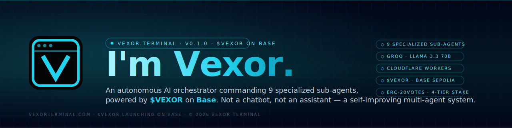
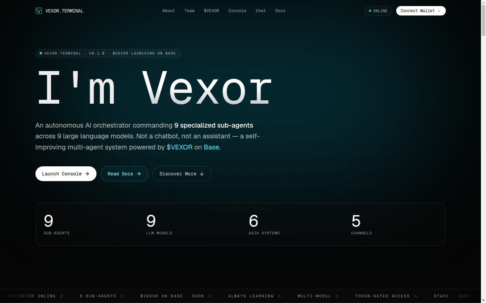
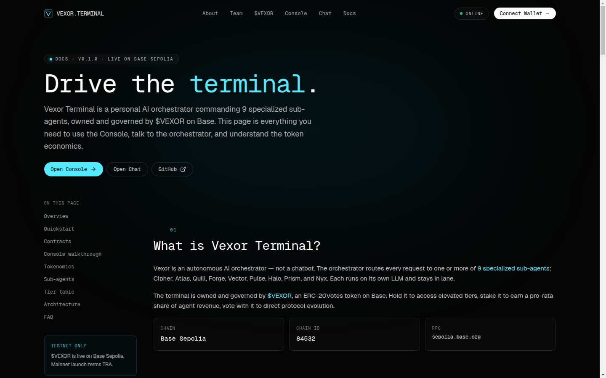

<div align="center">

<picture>
  <source srcset="docs/images/banner.png" type="image/png">
  
</picture>

<br>

**An autonomous AI orchestrator commanding 9 specialized sub-agents — powered by [$VT](https://basescan.org/address/0x2c684D666998436634EcEde1527EdA7975427Ba3) on [Base](https://base.org).**
<br>
Not a chatbot. Not an assistant. A self-improving multi-agent system.

<br>

[](https://vexorterminal.com)
[](https://base.org)
[](https://workers.cloudflare.com)
[](https://nextjs.org)
[](https://soliditylang.org)
[](#license)

[**Live site** ↗](https://vexorterminal.com) ·
[Docs ↗](https://vexorterminal.com/docs) ·
[$VT on Basescan ↗](https://basescan.org/address/0x2c684D666998436634EcEde1527EdA7975427Ba3) ·
[@vexorterminal ↗](https://x.com/vexorterminal)

<br>



</div>

---

## Features

- **Vexor Orchestrator** — a single LLM that routes every request to one of 9 specialized sub-agents (Cipher, Atlas, Quill, Forge, Vector, Pulse, Halo, Prism, Nyx). Each agent runs on its own LLM and stays in lane.
- **$VT token (Base)** — live ERC-20 on Base mainnet ([`0x2c68…7Ba3`](https://basescan.org/address/0x2c684D666998436634EcEde1527EdA7975427Ba3)), 100B supply, 18 decimals. Hold to access elevated tiers, stake to earn pro-rata agent revenue, vote with it to direct protocol evolution.
- **4-tier time-locked staking** — `FLEX`, `30D`, `90D`, `LOCK_180` with weighted multipliers for governance.
- **On-chain governance** — OpenZeppelin Governor v5, weighted by staked balance × time-lock multiplier.
- **Wallet-gated console** — connect wallet, claim from faucet, stake, govern, all on Base Sepolia testnet during beta (mainnet migration alongside production launch).
- **Production chat** — Groq Llama 3.3 70B proxied through a single Cloudflare Worker with strict CORS allowlist.
- **Static-first frontend** — Next.js 16 static export, hosted as Worker Assets — fast edge delivery worldwide, no Node runtime in production.

---

## Quick start

```bash
git clone https://github.com/Vexorterminal0111/vexor-terminal.git
cd vexor-terminal
pnpm install
cp .env.example .env.local
pnpm dev          # → http://localhost:3000
```

Production build (always pass `--webpack` — see [Note on Next.js 16](#note-on-nextjs-16)):

```bash
pnpm build --webpack
```

The static site lands in `out/`. The Cloudflare Worker in `worker/` serves it through the `ASSETS` binding and routes `/api/chat` to the Groq proxy.

---

## On-chain

<div align="center">



</div>

### Base mainnet · live

| Contract | Address | Basescan |
|---|---|---|
| `$VT` — Vexor Terminal token (ERC-20, 100B supply, 18 decimals) | `0x2c684D666998436634EcEde1527EdA7975427Ba3` | [view ↗](https://basescan.org/address/0x2c684D666998436634EcEde1527EdA7975427Ba3) |

### Base Sepolia · testnet console demo

The interactive Console (claim / stake / govern) currently runs against these Base Sepolia contracts so anyone can try the protocol without spending real gas. The testnet $VT is a separate token from mainnet $VT — it has no monetary value and cannot be bridged.

| Contract | Address | Basescan |
|---|---|---|
| `VexorToken` — ERC-20Votes + Permit + faucet | `0x200b75db62fa66f325191b34ef784ade26321570` | [view ↗](https://sepolia.basescan.org/address/0x200b75db62fa66f325191b34ef784ade26321570) |
| `VexorStaking` — 4-tier time-locked staking | `0x6a345b8390a67681764521d146853211dd089062` | [view ↗](https://sepolia.basescan.org/address/0x6a345b8390a67681764521d146853211dd089062) |
| `VexorGovernor` — OZ Governor v5 (weighted votes) | `0xd1850b4c2e663b45a49330d00637db78197be31c` | [view ↗](https://sepolia.basescan.org/address/0xd1850b4c2e663b45a49330d00637db78197be31c) |

> $VT is a utility token, not a security. Staking and governance will migrate from Sepolia testnet to Base mainnet alongside production launch.

---

## Tech stack

| Layer | Stack |
|---|---|
| **Frontend** | Next.js 16 (App Router · static export) · TypeScript · Tailwind CSS v4 · Framer Motion · Geist / Geist Mono |
| **Web3** | wagmi v2 · viem · RainbowKit · WalletConnect |
| **Smart contracts** | Solidity 0.8.26 · Foundry · OpenZeppelin v5 (ERC-20Votes, Permit, Governor) |
| **Chat backend (prod)** | Cloudflare Worker (TypeScript) · Groq (Llama 3.3 70B) |
| **Chat backend (local dev)** | FastAPI · Groq · `uv` |
| **Hosting** | Cloudflare Workers + Assets (static site + edge function in one Worker) |
| **CI / lint** | ESLint flat config · `npx tsc --noEmit` · `forge test -vv` |

---

## Repo layout

```
.
├── src/                       # Next.js app (landing + /docs)
│   ├── app/                   # Routes, layout, static export config
│   ├── components/            # Nav, Hero, Console, Chat, Docs, ...
│   └── lib/contracts.ts       # Contract addresses + ABIs (frontend)
├── worker/                    # Cloudflare Worker (production runtime)
│   ├── index.ts               # Entry — routes /api/chat + serves assets
│   ├── chat.ts                # Groq proxy + CORS allowlist
│   └── tsconfig.json
├── wrangler.jsonc             # Cloudflare Workers config
├── contracts/                 # Foundry project — Token / Staking / Governor
│   ├── src/                   # Solidity sources
│   ├── test/                  # Foundry tests (9/9 passing)
│   └── script/Deploy.s.sol
├── apps/chat-api/             # FastAPI chat proxy (local dev only)
├── docs/images/               # README screenshots + banner
└── public/                    # Static assets (favicons, OG, logo)
```

---

## Architecture

```
       ┌─────────────────┐         POST /api/chat        ┌─────────────────┐
       │   Browser       │ ───────────────────────────▶  │ Cloudflare      │
       │ (Next.js SSG)   │ ◀────────────────────────────│ Worker          │
       └────────┬────────┘     {reply, cost_units, ...}  │   (worker/)     │
                │ wallet RPC                              │ ASSETS binding  │
                ▼                                         └────────┬────────┘
       ┌─────────────────┐                                         │ HTTPS
       │ Base mainnet    │                                         ▼
       │  - $VT (ERC-20) │                                ┌─────────────────┐
       ├─────────────────┤                                │ Groq            │
       │ Base Sepolia    │   (console demo)               │ Llama 3.3 70B   │
       │  - VexorToken   │                                └─────────────────┘
       │  - VexorStaking │
       │  - VexorGovernor│
       └─────────────────┘
```

- Frontend is statically exported and served by the Worker `ASSETS` binding.
- `/api/chat` is the only dynamic route — handled by `worker/chat.ts`, talks to Groq.
- Rate limiting is delegated to Cloudflare Rate Limiting Rules (module-scope state doesn't survive Worker isolate recycles).

---

## Smart contracts

```bash
cd contracts
forge install foundry-rs/forge-std --no-commit
forge install OpenZeppelin/openzeppelin-contracts --no-commit
forge build
forge test -vv          # 9/9 passing
```

See [`contracts/README.md`](contracts/README.md) for the full deploy + verify guide.

The token implements `ERC20Votes`, `ERC20Permit`, and a metered testnet faucet. The staking contract tracks `weightedAmount = principal × multiplier(tier)` and exposes that to the Governor for voting power. The Governor is the standard OZ v5 Governor + GovernorVotes + GovernorVotesQuorumFraction + GovernorTimelockControl stack.

---

## Deploy — Cloudflare Workers

Production is a single Cloudflare Worker that:
1. Serves the Next.js static export via the `ASSETS` binding.
2. Routes `POST /api/chat` to `worker/chat.ts`.

Config lives in [`wrangler.jsonc`](./wrangler.jsonc).

**Workers Builds (GitHub-connected)** — set these in the Cloudflare dashboard:

| Setting | Value |
|---|---|
| Build command | `pnpm build --webpack` |
| Deploy command | `npx wrangler deploy` (auto, reads `wrangler.jsonc`) |
| Root directory | `/` |

**Secrets** (set in dashboard, not in repo):

| Name | Where | Notes |
|---|---|---|
| `GROQ_API_KEY` | Worker secret | Used by `worker/chat.ts` |
| `ALLOWED_ORIGINS` | Worker var | `https://vexorterminal.com,https://www.vexorterminal.com` |
| `NEXT_PUBLIC_VEXOR_TOKEN_TESTNET` | Build env | Baked into the static export |
| `NEXT_PUBLIC_VEXOR_STAKING_TESTNET` | Build env | Baked into the static export |
| `NEXT_PUBLIC_VEXOR_GOVERNANCE_TESTNET` | Build env | Baked into the static export |

Manual deploy from a local clone:

```bash
pnpm build --webpack
npx wrangler deploy
```

---

## Chat API

### Production — Cloudflare Worker

Lives in [`worker/chat.ts`](./worker/chat.ts), mounted by [`worker/index.ts`](./worker/index.ts) at `/api/chat`. Validates the wallet address, calls Groq (Llama 3.3 70B) with the Vexor orchestrator system prompt, returns the reply. CORS is strictly allowlisted via `ALLOWED_ORIGINS`.

Type-check locally:

```bash
npx tsc --noEmit -p worker/tsconfig.json
```

### Local dev — FastAPI

For a long-lived dev server (e.g. when iterating on prompt logic), use the Python mirror in [`apps/chat-api/`](apps/chat-api/):

```bash
cd apps/chat-api
uv sync
export GROQ_API_KEY=...
uvicorn vexor_chat.main:app --reload --port 8000
```

Then set `NEXT_PUBLIC_CHAT_API_URL=http://localhost:8000` in `.env.local`.

---

## Note on Next.js 16

Always build with `--webpack`:

```bash
pnpm build --webpack
```

Turbopack currently emits chunk filenames with double dots, which some static hosts (including Cloudflare's `ASSETS` binding) strip. See [`AGENTS.md`](./AGENTS.md) for details.

---

## Mirrors

This repo lives on two networks:

| Network | URL |
|---|---|
| **GitHub** (primary) | https://github.com/Vexorterminal0111/vexor-terminal |
| **gitlawb** (decentralized mirror) | https://gitlawb.com/z6MksEgptSG69SeQYJx7HCtjPGMok5yDB6rndeY2Y5KujAdj/vexor-terminal |

Clone from gitlawb:

```bash
# DID-based (libp2p)
git clone gitlawb://did:key:z6MksEgptSG69SeQYJx7HCtjPGMok5yDB6rndeY2Y5KujAdj/vexor-terminal

# HTTP fallback
git clone https://node.gitlawb.com/z6MksEgptSG69SeQYJx7HCtjPGMok5yDB6rndeY2Y5KujAdj/vexor-terminal.git
```

---

## Roadmap

| Phase | Status | Description |
|---|---|---|
| 1. Landing | **Live** | Marketing site, branding, docs |
| 2. Console | **Live (testnet)** | Wallet connect + claim / stake / govern / tier on Base Sepolia |
| 3. Chat | **Live (beta)** | Llama 3.3 70B routed by Vexor, rate-limited at the edge |
| 4. Mainnet token | **Live** | $VT deployed on Base mainnet ([`0x2c68…7Ba3`](https://basescan.org/address/0x2c684D666998436634EcEde1527EdA7975427Ba3)) — 100B supply, 18 decimals |
| 5. Mainnet staking + governance | Planned | Migrate staking + Governor contracts from Sepolia to Base mainnet |
| 6. Sub-agent runtime | Planned | Real orchestrator + 9 sub-agents on production hardware |

---

## Links

- **Live site** — https://vexorterminal.com
- **Docs** — https://vexorterminal.com/docs
- **X / Twitter** — [@vexorterminal](https://x.com/vexorterminal)
- **GitHub** — https://github.com/Vexorterminal0111/vexor-terminal
- **gitlawb mirror** — https://gitlawb.com/z6MksEgptSG69SeQYJx7HCtjPGMok5yDB6rndeY2Y5KujAdj/vexor-terminal
- **$VT token (Base mainnet)** — [`0x2c684D66...27Ba3`](https://basescan.org/address/0x2c684D666998436634EcEde1527EdA7975427Ba3)
- **VexorToken (Base Sepolia testnet)** — [`0x200b75db...21570`](https://sepolia.basescan.org/address/0x200b75db62fa66f325191b34ef784ade26321570)
- **VexorStaking (Base Sepolia testnet)** — [`0x6a345b83...89062`](https://sepolia.basescan.org/address/0x6a345b8390a67681764521d146853211dd089062)
- **VexorGovernor (Base Sepolia testnet)** — [`0xd1850b4c...be31c`](https://sepolia.basescan.org/address/0xd1850b4c2e663b45a49330d00637db78197be31c)

---

## License

MIT — see [`LICENSE`](./LICENSE) (or the SPDX identifier `MIT` in source headers).

<div align="center">

<sub>Designed in the terminal. $VEXOR launching on Base.</sub>

</div>
